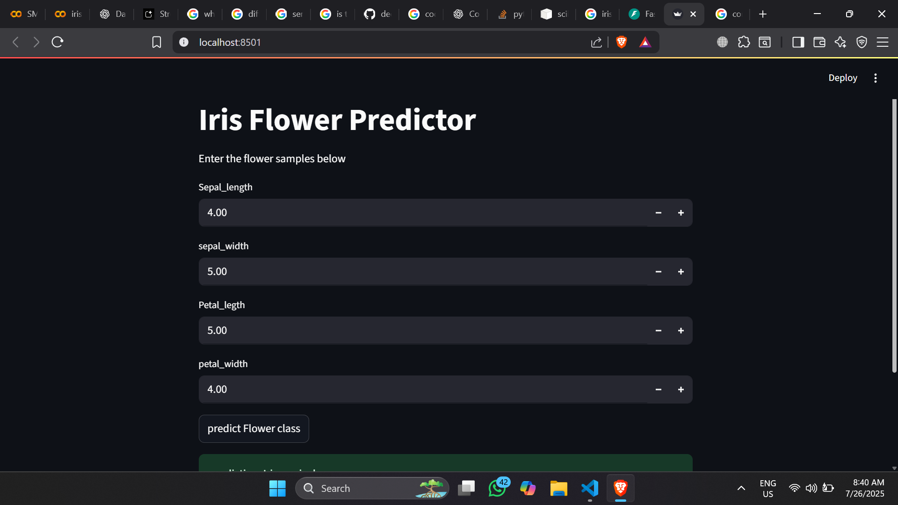

Here is a clean, beginner-friendly `README.md` file for your Iris Flower Classifier FastAPI + Streamlit project:

---

```markdown
# 🌸 Iris Flower Classifier 🌸

This is a simple **Machine Learning web application** built using:

- 🚀 **FastAPI** for the backend (API)
- 🎈 **Streamlit** for the frontend (UI)
- 🌿 A pre-trained model (Random Forest, Decision Tree, etc.) serialized with `pickle`
- 🔍 It predicts the class of Iris flower (Setosa, Virginica, or Versicolor) based on input features.

---

## 📦 Project Structure

```

iris\_data\_classifier/
│
├── model.pkl            # Trained ML model (pickle file)
├── app.py               # FastAPI backend for prediction
├── streamlit\_app.py     # Streamlit frontend for user input
├── README.md            # Project documentation
├── requirements.txt     # Python dependencies
└── ...

````

---

## 🚀 How to Run the App Locally

### 1. Clone the repository

```bash
git clone https://github.com/your-username/iris_data_classifier.git
cd iris_data_classifier
````

### 2. Create a virtual environment

```bash
python -m venv myenv
myenv\Scripts\activate   # For Windows
# or
source myenv/bin/activate  # For macOS/Linux
```

### 3. Install dependencies

```bash
pip install -r requirements.txt
```

> Or install manually:

```bash
pip install fastapi uvicorn streamlit scikit-learn pydantic
```

### 4. Start the FastAPI server

```bash
uvicorn app:app --reload
```

The API will run at: [http://127.0.0.1:8000](http://127.0.0.1:8000)

### 5. Start the Streamlit app

In a **new terminal**, run:

```bash
streamlit run streamlit_app.py
```

---

## 📬 API Endpoint

| Method | Endpoint      | Description        |
| ------ | ------------- | ------------------ |
| POST   | `/prediction` | Predict Iris class |
| GET    | `/`           | Welcome message    |

### 🔄 Sample POST body

```json
{
  "sepal_length": 5.1,
  "sepal_width": 3.5,
  "petal_length": 1.4,
  "petal_width": 0.2
}
```

---

## 💡 Features

* Easy-to-use Streamlit frontend
* Input validation using Pydantic
* Clean API with Swagger UI at `/docs`
* Reusable `model.pkl` with any Scikit-learn classifier

---

## 🖼️ Screenshot



---

## ✅ Example Prediction

**Input:**

```
sepal_length = 5.1
sepal_width = 3.5
petal_length = 1.4
petal_width = 0.2
```

**Output:**

```
Prediction: Iris setosa
```

---

## 📚 Requirements

* Python 3.7+
* FastAPI
* Streamlit
* scikit-learn
* requests
* pydantic

---

## 🙋‍♂️ Author

Developed by \[Mir Ikrammullah Reasani] — Feel free to connect on [LinkedIn](https://www.linkedin.com/in/mir-ikrammullah-reasani-41566b312?utm_source=share&utm_campaign=share_via&utm_content=profile&utm_medium=android_app )!

---

## 📃 License

This project is licensed under the MIT License.

```

---

Let me know if you'd like me to:
- Generate a `requirements.txt` file
- Help publish this on GitHub with proper structure  
- Add a `.gif` or image to the README

Just say the word!
```
